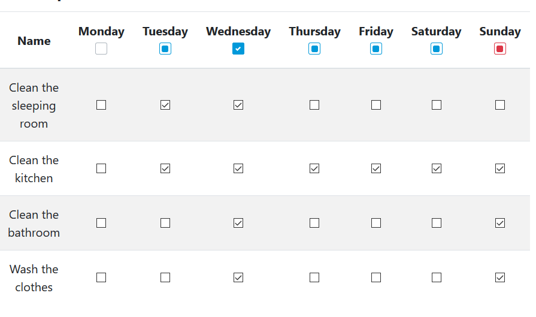

# NgTriStateCheckbox
This is a three state checkbox for angular 9. Which is easy to implement and to use. It supports custom styles and can be easily modified.

It can be used to select some entries from a list and control it. The user can select / unselect all entries by one click.



## Installation
It can be installed with npm or yarn
```bash
npm install ng-tri-state-checkbox --save
```
or:
```bash
yarn install ng-tri-state-checkbox
```

### Add NgTriStateCheckboxModule to your module
To use the component you have to add the module "NgTriStateCheckboxModule" to your application.
```typescript
import { NgModule } from '@angular/core';
import { NgTriStateCheckboxModule } from 'ng-tri-state-checkbox';
import { FormsModule, ReactiveFormsModule } from '@angular/forms';

@NgModule({
    imports: [
        // This modules are required to use the ngModel to access the the value of the checkbox
        FormsModule, 
        ReactiveFormsModule,
        // Simply add this module
        NgTriStateCheckboxModule 
    ],
})
export class AppModule { }

```

## Usage
For a more complex implementation see the [Sample application](#sample-application) section in this documentation.

### API
#### NgTriStateCheckboxComponent
#### NgTriStateControlDirective

## Custom styles
See the example style in: [src/tri-state-checkbox-sample/src/app/basic-sample/basic-sample.component.scss](https://github.com/src/tri-state-checkbox-sample/src/app/basic-sample/basic-sample.component.scss).
And the usage on the sunday [src/tri-state-checkbox-sample/src/app/basic-sample/basic-sample.component.html](https://github.com/src/tri-state-checkbox-sample/src/app/basic-sample/basic-sample.component.html) checkbox.

To replace the default style for the component simply use the tag "checkboxClass" and set the class.
```angular2html
<th scope="col">Sunday<br /><ng-tri-state-checkbox ... checkboxClass="tri-state-checkbox-sunday"></ng-tri-state-checkbox></th>
```

## Sample application
The sourcecode of sample application can be found in [src/tri-state-checkbox-sample/](https://github.com/tarienna/ng-tri-state-checkbox/tree/master/src/tri-state-checkbox-sample/).


### Before you start 
To run the sample application it is required to download the source code first.

#### Download the source code
You can download the source code using [git](#download-the-source-code-with-git) or as a [zip](#download-the-source-code-as-zip). Descriptions are below.
##### Download the Source code with git
Before you download the source code create a new empty directory! Open the console in the empty directory and check out the source code.
```bash
git clone https://github.com/tarienna/ng-tri-state-checkbox.git
```
##### Download the source code as zip
There is also the possibility to download the project as zip: [Click here to download](https://github.com/tarienna/ng-tri-state-checkbox/archive/master.zip). You now you have to unpage the zip.

#### Install the node packages
Simply type in the console in the root directory of the project:
```bash
npm install
```

#### Start the Application
To run the application you have to open a console in the root directory and type:
```bash
npm run start:example
```
